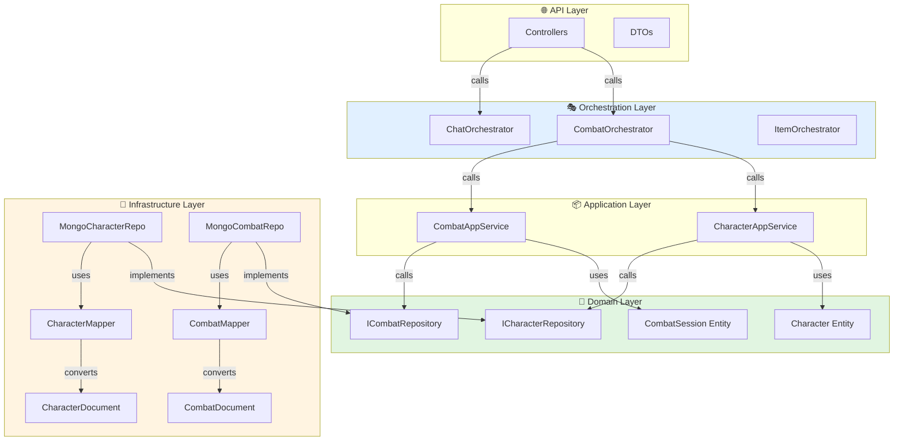

# Analyse Architecture : Dépendances Circulaires

## ✅ Votre Architecture Actuelle (Bonne Base)

### Hiérarchie Actuelle
```
Orchestrators
    ↓
AppServices (CombatAppService)
    ↓
Domain Services (InitService, TurnOrderService, etc.)
    ↓
Persistence (Mongoose Models)
```

**Points forts :**
- ✅ Séparation claire des responsabilités
- ✅ Flux unidirectionnel (pas de cycles)
- ✅ Domain services isolés (ne peuvent pas s'appeler entre eux)
- ✅ Orchestrators peuvent appeler des services cross-domain

### Problème Identifié
Votre architecture actuelle est **déjà bonne** concernant les dépendances circulaires ! Le problème n'est pas là.

## ❌ Problème Réel : Couplage Infrastructure

Le vrai problème est que vos **entités métier n'existent pas**. Vous avez :

```typescript
// ❌ Actuellement
CharacterService → CharacterDocument (Mongoose)
CombatAppService → CombatSession (Mongoose)
```

**Conséquences :**
1. Logique métier dans les services (devrait être dans les entités)
2. Tests difficiles (dépendance MongoDB)
3. Changement de DB = réécrire tout

## ✅ Architecture Proposée (Pas de Cycles !)

### Nouvelle Hiérarchie (Clean Architecture)

```
┌─────────────────────────────────────────────────────────────┐
│ API Layer (Controllers)                                      │
│   - CharacterController                                      │
│   - CombatController                                         │
└───────────────────────┬─────────────────────────────────────┘
                        │
                        ↓ (DTO → Entity)
┌─────────────────────────────────────────────────────────────┐
│ Orchestrators                                                │
│   - ChatOrchestrator                                         │
│   - CombatOrchestrator                                       │
│   - ItemOrchestrator                                         │
└───────────┬───────────────────────┬─────────────────────────┘
            ↓                       ↓
┌───────────────────────┐  ┌───────────────────────────────────┐
│ Application Services  │  │ Application Services              │
│   - CharacterAppSvc   │  │   - CombatAppService              │
│   - SpellAppSvc       │  │   - ItemAppService                │
└─────────┬─────────────┘  └───────────┬───────────────────────┘
          ↓                             ↓
┌─────────────────────────────────────────────────────────────┐
│ Domain Layer (PAS DE DÉPENDANCES ENTRE EUX)                 │
│                                                              │
│  ┌──────────────────┐    ┌──────────────────┐              │
│  │ Character Domain │    │ Combat Domain    │              │
│  │                  │    │                  │              │
│  │ - Character      │    │ - CombatSession  │              │
│  │   (entity)       │    │   (entity)       │              │
│  │ - CharacterStats │    │ - Combatant      │              │
│  │   (value obj)    │    │   (value obj)    │              │
│  │ - ICharRepo      │    │ - ICombatRepo    │              │
│  │   (interface)    │    │   (interface)    │              │
│  └──────────────────┘    └──────────────────┘              │
│                                                              │
│  Domain services NE S'APPELLENT JAMAIS entre domaines       │
└─────────┬───────────────────────────┬─────────────────────┘
          ↓                           ↓
┌─────────────────────────────────────────────────────────────┐
│ Infrastructure Layer                                         │
│                                                              │
│  ┌───────────────────────┐   ┌────────────────────────┐    │
│  │ MonoCharacterRepo     │   │ MongoCombatRepo        │    │
│  │ (implements ICharRepo)│   │ (implements ICombatRepo)│   │
│  │                       │   │                        │    │
│  │ - CharacterMapper     │   │ - CombatMapper         │    │
│  │ - CharacterDocument   │   │ - CombatDocument       │    │
│  └───────────────────────┘   └────────────────────────┘    │
└─────────────────────────────────────────────────────────────┘
```

### Flux de Dépendances (Unidirectionnel)



## 🎯 Règles Anti-Cycles

### ✅ Autorisé

```typescript
// ✅ Orchestrator → Multiple App Services
class CombatOrchestrator {
  constructor(
    private combatApp: CombatAppService,
    private characterApp: CharacterAppService,  // OK !
    private diceService: DiceService,           // OK !
  ) {}
}

// ✅ App Service → Domain Entity + Repository
class CharacterAppService {
  constructor(
    @Inject(ICharacterRepository)
    private repo: ICharacterRepository,
  ) {}
  
  async levelUp(id: string) {
    const character = await this.repo.findById(id);  // Entity
    character.levelUp();                              // Logique métier
    await this.repo.save(character);
  }
}

// ✅ Domain Entity → Value Objects (même domaine)
class Character {
  constructor(
    private stats: CharacterStats,  // OK (même domaine)
    private pa: ResourcePool,       // OK (même domaine)
  ) {}
}

// ✅ Infrastructure → Domain (via interface)
class MongoCharacterRepository implements ICharacterRepository {
  // Implémente l'interface du domaine
}
```

### ❌ Interdit (Crée des Cycles)

```typescript
// ❌ Domain Service → Domain Service (autre domaine)
class CharacterDomainService {
  constructor(
    private combatService: CombatDomainService,  // ❌ INTERDIT !
  ) {}
}

// ❌ Domain Entity → Infrastructure
class Character {
  constructor(
    private repo: MongoCharacterRepository,  // ❌ INTERDIT !
  ) {}
}

// ❌ Infrastructure → Application
class MongoCharacterRepository {
  constructor(
    private appService: CharacterAppService,  // ❌ INTERDIT !
  ) {}
}

// ❌ App Service → Orchestrator
class CharacterAppService {
  constructor(
    private orchestrator: CombatOrchestrator,  // ❌ INTERDIT !
  ) {}
}
```

## 📊 Comparaison : Actuel vs Proposé

| Aspect | Architecture Actuelle | Clean Architecture Proposée |
|--------|----------------------|---------------------------|
| **Cycles** | ✅ Aucun | ✅ Aucun |
| **Entités métier** | ❌ Pas d'entités | ✅ Entités avec logique |
| **Couplage DB** | ❌ Fort (Services ↔ Mongoose) | ✅ Faible (via interfaces) |
| **Tests unitaires** | ❌ Difficile (besoin MongoDB) | ✅ Facile (mock interfaces) |
| **Changement DB** | ❌ Refactoring massif | ✅ Change que le repo |
| **Logique métier** | ❌ Dans les services | ✅ Dans les entités |

## 🚀 Migration Sans Casser l'Existant

### Étape 1 : Ajouter sans toucher

```typescript
// 1. Créer les nouvelles couches SANS toucher l'existant
apps/backend/src/
├── domain/
│   └── character/
│       ├── entities/
│       │   └── Character.ts          // ✨ NOUVEAU
│       ├── value-objects/
│       │   └── CharacterStats.ts     // ✨ NOUVEAU
│       └── repositories/
│           └── ICharacterRepository.ts // ✨ NOUVEAU
│
├── infrastructure/
│   └── persistence/
│       └── mongo/
│           ├── mappers/
│           │   └── CharacterMapper.ts    // ✨ NOUVEAU
│           └── repositories/
│               └── MongoCharacterRepository.ts // ✨ NOUVEAU
│
├── application/
│   └── character/
│       └── CharacterAppService.ts    // ✨ NOUVEAU
│
└── domain/              # ⚠️ ANCIEN (reste tel quel)
    └── character/
        └── character.service.ts      # Garde pour compatibilité
```

### Étape 2 : Migrer progressivement

```typescript
// CharacterController AVANT (utilise l'ancien)
@Controller('characters')
export class CharacterController {
  constructor(
    private characterService: CharacterService,  // ⚠️ ANCIEN
  ) {}
  
  @Get(':id')
  async findOne(@Param('id') id: string) {
    return this.characterService.findByCharacterId(userId, id);
  }
}

// CharacterController APRÈS (utilise le nouveau)
@Controller('characters')
export class CharacterController {
  constructor(
    private characterApp: CharacterAppService,  // ✅ NOUVEAU
  ) {}
  
  @Get(':id')
  async findOne(@Param('id') id: string) {
    const entity = await this.characterApp.findById(id);
    return CharacterDtoMapper.toDto(entity);
  }
}
```

### Étape 3 : Supprimer l'ancien (optionnel)

Une fois tout migré, supprimer `domain/character/character.service.ts`

## 🎯 Réponse à ta Question

> **Est-ce toujours OK de ce côté (dépendances circulaires) ?**

**Réponse : OUI, c'est même MIEUX qu'avant !**

### Pourquoi ?

1. **Aucun nouveau cycle introduit**
   - Les Orchestrators restent au top
   - Les App Services orchestrent (comme avant)
   - Les Domain Services sont isolés (comme avant)

2. **Meilleure séparation**
   - Domain Layer = 0 dépendance externe
   - Infrastructure = implémente les interfaces du domain
   - API = appelle Application qui appelle Domain

3. **Dépendances unidirectionnelles**
   ```
   API → Application → Domain ← Infrastructure
                         ↑
                    (interface)
   ```

### Ce qui change (en mieux)

| Avant | Après |
|-------|-------|
| `CharacterService` → `CharacterDocument` | `CharacterAppService` → `Character` (entity) |
| Logique métier dans le service | Logique métier dans l'entité |
| Tests = besoin MongoDB | Tests = mock IRepository |
| 1 couche (services) | 4 couches (séparation claire) |

## 📋 Checklist Anti-Cycles

Pour chaque nouvelle classe, vérifie :

- [ ] Est-ce un **Orchestrator** ?
  - ✅ Peut appeler : App Services, Services cross-domain
  - ❌ Ne peut pas appeler : Domain entities directement

- [ ] Est-ce un **App Service** ?
  - ✅ Peut appeler : Domain entities, Repositories (interfaces)
  - ❌ Ne peut pas appeler : Orchestrators, autres App Services

- [ ] Est-ce une **Domain Entity** ?
  - ✅ Peut utiliser : Value Objects (même domaine)
  - ❌ Ne peut pas appeler : Services, Repositories, autres domaines

- [ ] Est-ce un **Repository** (infrastructure) ?
  - ✅ Peut utiliser : Mappers, Documents Mongoose
  - ❌ Ne peut pas appeler : App Services, Orchestrators

## ✅ Conclusion

**Ton architecture actuelle n'a PAS de problème de cycles.**

**La migration proposée :**
- ✅ Garde le flux unidirectionnel
- ✅ Ajoute la séparation Domain/Infrastructure
- ✅ Améliore la testabilité
- ✅ **Ne crée AUCUN nouveau cycle**

**Tu peux migrer en toute confiance !** 🚀