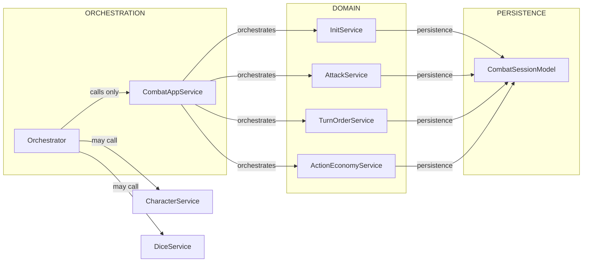

# Backend — Architecture

## Overview

The backend is structured around a modular domain-driven design. Each domain (e.g., combat, characters, items) encapsulates its own services, models, and data access layers. The main components include:

- **Domain Services**: Core business logic for each domain.
- **Data Models**: Mongoose schemas and models for MongoDB.
- **Controllers**: RESTful API endpoints exposing domain functionalities.

We also have orchestrator services that coordinate complex workflows across multiple domains.

CombatOrchestrator is an example of such a service, managing the entire combat flow by leveraging various domain services like CombatService, TurnOrderService, and ActionEconomyService.

## Orchestrators

Orchestrators are high-level services that manage complex workflows by coordinating multiple domain services.

They encapsulate the logic required to execute multi-step processes, ensuring that each step is performed in the correct order and handling any necessary state management.

## AppServices

Are high level services that rochestrate smaller one. They are allowed to import associated services domain.

## Domain Services

Are low-level services that implement core business logic for a specific domain. They are not allowed to import services from other domains nor app services.

## Architecture Diagram

Below is a simple diagram to summarize the allowed call relationships and responsibilities:

## Key Constraints & Intent

- Orchestrator → AppService → DomainServices → Persistence (Mongoose Model).
- Orchestrator is the only component allowed to call cross-domain or global services (e.g., CharacterService, DiceService). This keeps domain services pure and unit-testable.
- Domain services MUST NOT call services from other domains or the orchestrator — they should only rely on their domain helpers and the persistence layer (CombatSessionModel).
- Domain services may import the Mongoose model (CombatSessionModel) directly for persistence. If a common pattern emerges (e.g., audit fields, \_\_v checks, transaction/session handling), prefer creating a thin persistence wrapper (e.g., CombatService) that encapsulates those patterns to avoid duplication and ensure consistent behavior.
- CombatAppService (the application facade) coordinates domain services to implement high-level flows like startCombat, processAttack, endPlayerTurn, and delegates persistence to the model/wrapper as appropriate.
- AttackService, InitService, TurnOrderService, and ActionEconomyService are domain services focused on their own responsibilities and may call the CombatSessionModel directly provides standardized persistence semantics.
- For concurrent modifications (attacks, multiple requests), use one of:
  - Mongoose transactions (sessions)
  - Optimistic concurrency using \_\_v
  - A per-character distributed lock (e.g., Redis) to avoid race conditions.
